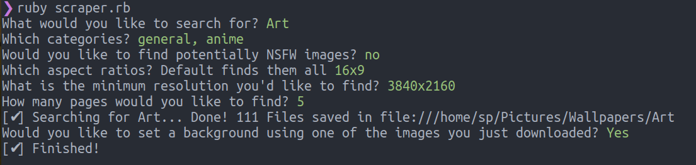

# A CLI tool that scrapes [wallhaven](https://alpha.wallhaven.cc/) and saves the images

## Installing

Requirements:

- Ruby 2.6,
- For setting the background you must be using GNOME

Clone the repo `git clone https://github.com/SPDUK/wallpaper-scraper`

Open the folder when cloning has done `cd wallpaper-scraper`

install dependencies `bundle install`

#

## Running the script

Simply run `ruby scraper.rb`, and then the terminal will ask you a few questions.

**use the arrow keys to navigate**

**use the spacebar to toggle an option**

**enter to submit.**

#

Once all options are selected it will then start scraping, depending on how many pages you search for it can take anywhere from a few seconds to a few minutes.

Files are saved to `/Pictures/Wallpapers` in folders seperated by what you searched for.

After everything is finished, it will ask if you want to set one of the wallpapers it saved as a background, if you are using GNOME and answer with "y", it will then select a random image from the ones it downloaded.
